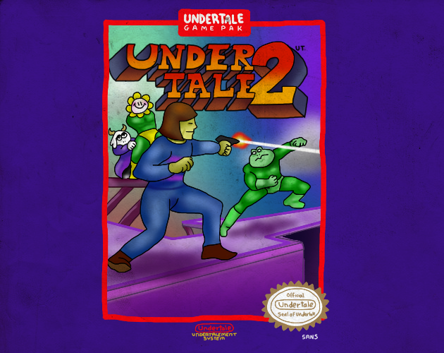
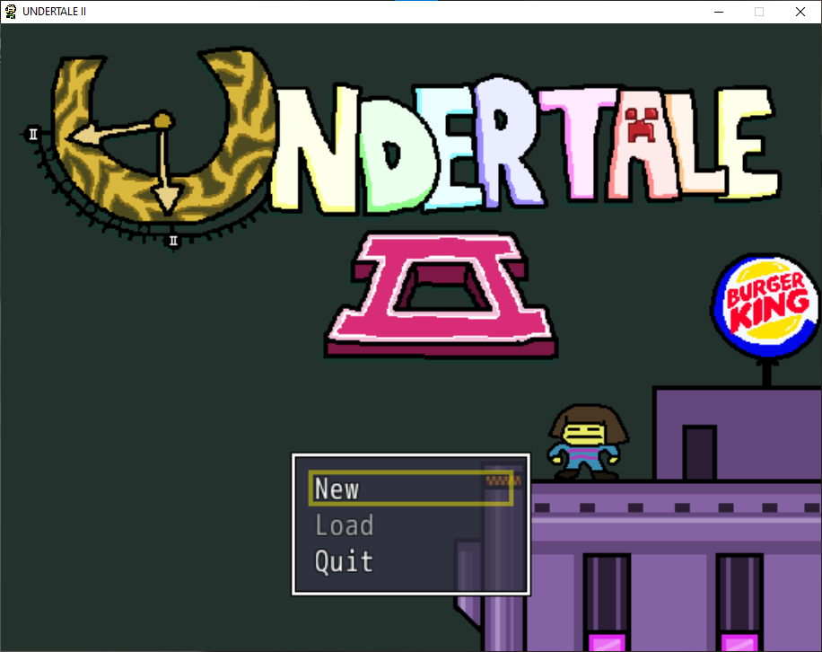

Undertale II: Revenge of the Robots is the single greatest Undertale fangame of all time. The plot, the writing, the gameplay, the characters, the art style... Everything about it is PEAK! However, this game is severly underrated, and I wish more people recognized how exceptional of a fan game it truly is.

# The Title Screen
Let's start with the TITLE SCREEN, because every aspect of this game deserves to be deeply analysed. It is a parody of the Mega Man 2 title screen: the screen goes up a purple building, until it reaches the top, where you find Frisk staring at the distance. A worse version of the original Undertale menu theme plays.

But there's more. The title screen has a hidden mechanic. After the Undertale 2 title fades, Frisk will start thinking about random things. The possible thoughts are the following.

 - Hamburger
 - Corn
 - That's me (Frisk plushie)
 - Tomatoes
 - Bubsy (from Bubsy 3D)
 - Sans Undertale (Sans plushie)
 - Ronald MacDonalds

Now, if you're lucky enough to get the same item multiple times in a row, a style meter will appear! It starts from Combo to Nice, Great Going and finally Stylish.

I hope this first part convinced you of the majesty of Undertale 2. The game is incredibly well detailed in other aspects as well. I will dedicate each part to a specific part of the game to ana
<!--stackedit_data:
eyJoaXN0b3J5IjpbNjQ2NzU2OTExLDExOTM4MjU5MTIsNDE3OT
g2NTE4LC04Mjk2MzE2LDEwMDQwNzY5MTIsMTAxMTMxOTk3OCwy
NDUwMzc2NzZdfQ==
-->