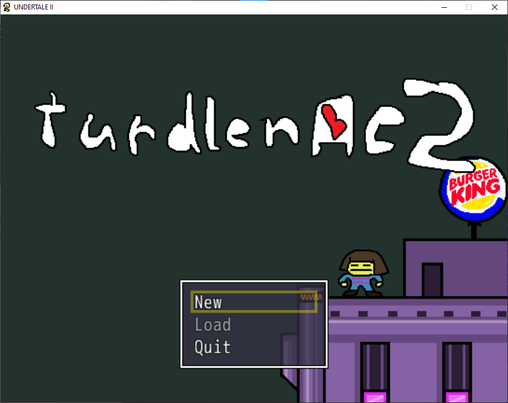
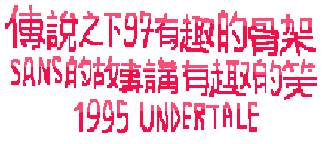
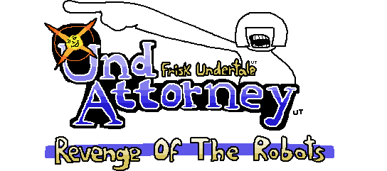

MORE STUFF ABOUT THE TITLE SCREEN OF UNDERTALE 2 YAHOO!!

I was supposed to write about the intro cutscene, but when starting the game I discovered something new. The music and main title can be randomised!

You have to get lucky to get one of these. There are 8 alternate titles:

 - Firsk Undertale: Und Attorney -- Revenge of the Robots
 - Under52
 - Undertale 3: Tickering Troupe Unite
 - Deltarune ZERO
 - Under Kong Taley 2: What Da Hecke
 - Funny Funny Undertale 2 Club! Haha!!
 - Honk Kong 97 copyright notice parody
 - turdlenae2

I have no idea what turdlenae2 is supposed to be a parody of. The music that plays alongside it is named "Shi**ymusic". 

I don't read chinese so I can't tell you what the Honk Kong 97 title says.

My favourite one is the Ace Attorney parody!

<!--stackedit_data:
eyJoaXN0b3J5IjpbLTE4MjE0MDcwMjgsMTcwMTEzNzAxNF19
-->